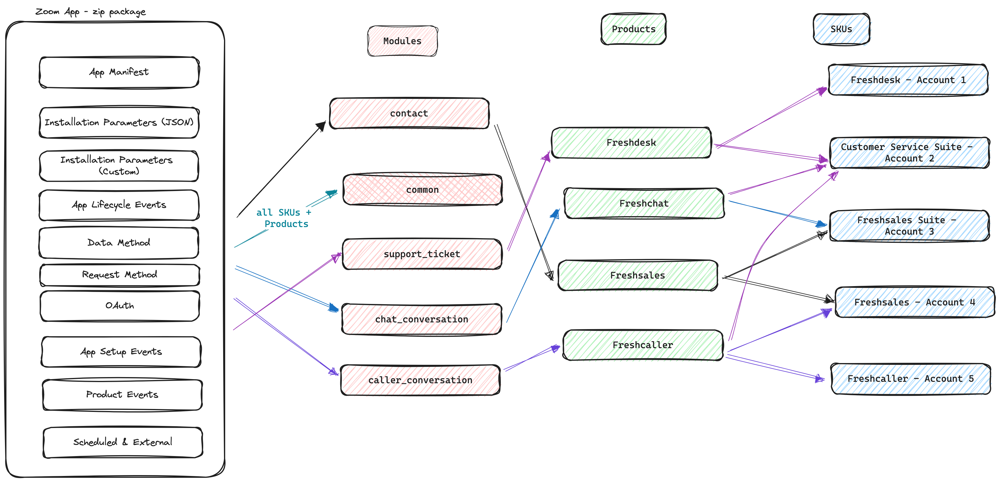

# global-app-features



### Set it up

Install the beta version of fdk by executing for the following command

```sh
npm install https://cdn.freshdev.io/fdk/v9.1.0-internal.tgz -g
```

### Build for Modules

- Global apps is a term that is used to describe freshworks customers can install an app that works across different Freshworks' products'
- The modular approach is a term described for developers to think of bulding features (for their apps) tied to functional units (modules) within a product (eg. freshdesk).
- The paradigm is building an app for a module at the build time, the app will run the app in supported products at the runtime.
