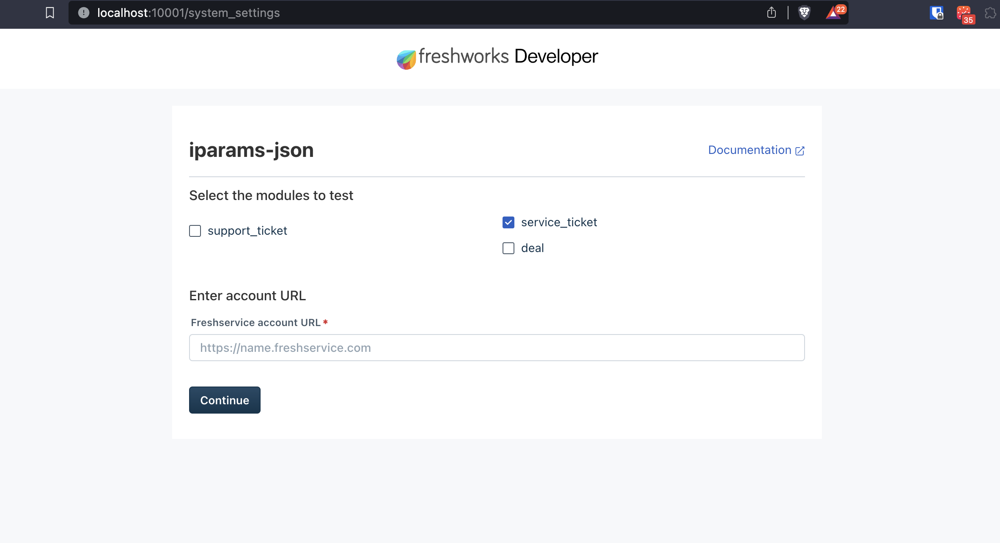

# Modular approach for `iparams.html`

# Simulation Setup Page

The users of global apps are can be either of:

- Freshdesk users
- Freshservice users
- Freshsales users
- Another Host product offered by Freshworks

## Crux

1. Installation pages are the ways users can input information to the app before even they are installed or ready to use.
2. `iparams.html` is a appraoch that developers can use write a regular web page and still store user inputs as installation parameters. They become available later at app's runtime.
3. An API key is good example — Your app is not useful until user actually gives an API key that perhaps is essential for the app to function correctly.

# Frequently Asked Questions

## Who will interact with installation page?

The installation page is the page which an admin user will interact with before installing the app.

## A single installation page for global app. How does it work?

The installation pages are rendered to the admin users, platform gives developer a way to choose what fields are renders to which users. For example, the app will need `email` field only for app users of `service_ticket` -> Freshservice.

## How does my app ensure relevant fields render to relevant users?

As a developer, you have the freedom that custom installation is expected to provide.The platform will provide you the following:

### What modules is the host (my customer) have?

```js
let client = await app.initialized();
let data = await client.data.get("currentHost");
subscribed_modules = await data.currentHost.subscribed_modules;
return subscribed_modules; // ['deal', 'support_ticket']
```

## Ok, How do I show or hide relavant fields to the user?

By using the Web APIs of the browser.

```js
if (modules.includes("support_ticket") || modules.includes("deal")) {
  fields.hide("email-field");
}

if (modules.includes("service_ticket")) {
  fields.hide("group-field");
}
```

## How do I store and retrive parameters to the platform?

```js
function getConfigs(configs) {
  // retrive and render to user
  groupField.value = configs.groups;
  emailField.value = configs.email;
  darkModeField.value = configs.dark_mode;
}

function postConfigs() {
  // store when user installs
  return {
    __meta: {
      secure: ["dark_mode"],
      modules: {
        support_ticket: ["groups"],
        deal: ["deal"],
        service_ticket: ["email"],
      },
    },
    groups: groupField.value,
    email: emailField.value,
    dark_mode: darkModeField.checked,
  };
}
```

## When storing - how do I map the user inputs to modules?

```js

// this on return obj of `postConfigs()`
    __meta: {
      secure: ["dark_mode"],
      modules: {
        support_ticket: ["groups"],
        deal: ["deal"],
        service_ticket: ["email"],
      }
```

## How do I access the user inputs programatically?

- If you want to access the user input to perform validations before the inputs are stored (or user successfully installs), you can write javascript in `validate()` definition.
- Once the inputs are stored as iparams with the platform, you can access them at runtime at the declared modules using data method or serverless payloads.

## Isn't it tricky to locally test as a user, when I can have user might be using any Freshworks Host product?

Yes.

We are introducing a new feature in local simulation called app setup page that will let you assume the user and continue testing you app.

In short, as a developer you can select the modules (hence, host freshworks' product) that a user might be subscribed. The continuation will be an simulation as per prior selections. This will let you try different selection combinations to test your app for any potential user of your global app.


## What does this App Setup Page look like?

Like this:



## Why should I enter product URLs in App Setup Page?

We empower apps to grab the URL at runtime of their customer's instance without customer/users giving it to the app.

This means platform will provide APIs to the app developers so that developer can use them, for example to make REST API calls.

During simulation the app is still in development time and not installed on a account yet. To facilitate seamless simulation, this setup page will ask you for the URL. You can give URL of your developer subscription since you will continue simulation in those accounts.
